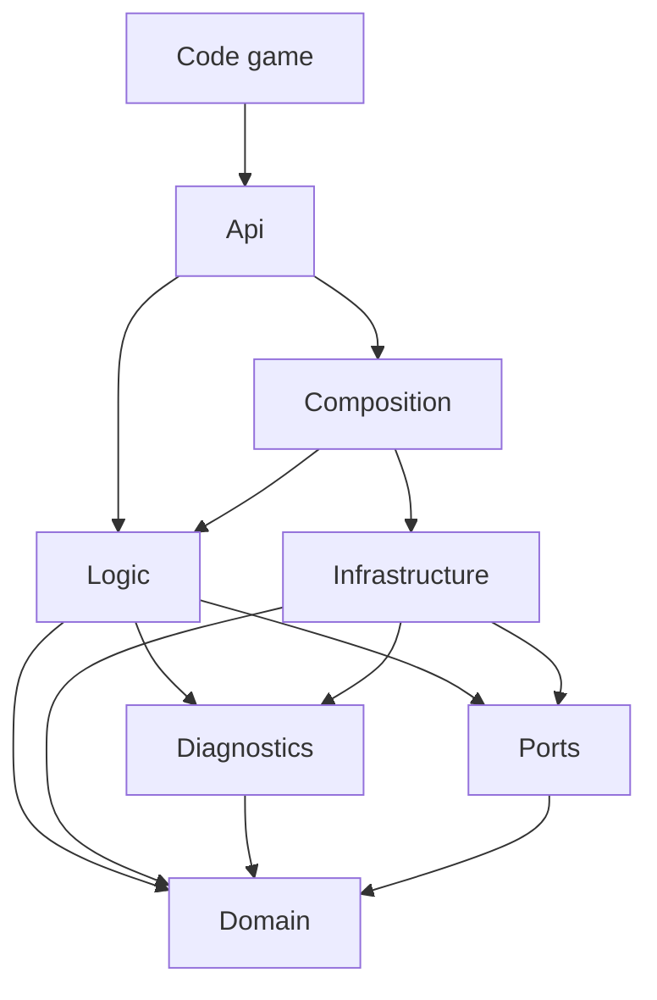

# Kiến trúc HDCLib

Tài liệu cho người sửa HDCLib: các tầng, mỗi thư mục chứa gì, tầng nào được dùng tầng nào, và các bước thêm mạng quảng cáo, partner mediation, kênh và nút debug. Cách dùng thư viện trong game xem [README](README.md).

## Một lời gọi đi qua những đâu

Ví dụ game gọi `HDCAds.ForceAd.Show("gameplay")`:

1. `HDCAds` (tầng Api) chỉ chuyển lời gọi tới kênh của runtime đang chạy, `HDCAdsRuntime.Current`.
2. Kênh `HDCForceAds` (Logic) xét các điều kiện: kênh bật, position bật, capping, người chơi đã gỡ quảng cáo chưa. Nó lấy group của position từ `HDCAdGroups`.
3. Group được dựng từ các plan:
   - `IUnitOrderPolicy` đổi `mediationPriority` và `useBackup` của group thành thứ tự các mạng.
   - Theo thứ tự đó, mạng nào phục vụ unit trong config thì trả về một `HDCAdPlan` (instance id, định dạng, ad unit). Mạng không phục vụ thì bỏ qua.
   - Mỗi plan thành một ad (`IFullscreenAd`).
4. Ad thật nằm ở tầng Infrastructure: `HDCAdMobNetwork` (plugin Google Mobile Ads) hoặc `HDCNativeNetwork` (thư viện native cho Android và iOS).
5. Sự kiện của ad (load, show, paid, close…) đi qua `HDCAdsSdk.Emit`, rồi tới:
   - tracker của bảng debug, để ghi lại;
   - context, để tính doanh thu (`HDCAds.Revenue`) và mốc capping;
   - group, để chuyển sang ad backup khi ad trước lỗi.

Khi SDK sẵn sàng, `HDCChannels` gọi `OnSdkInitialized` của từng kênh theo thứ tự `HDCChannels.All`: AL, AR, RW, FA, BN, MREC, PU. Bảng debug cũng hiện các tab theo thứ tự này.

## Các tầng

Assembly `HDC.Ads` nằm trong `Runtime/`. Mỗi thư mục con là một tầng, và namespace theo tên thư mục.

| Tầng | Namespace | Chứa gì |
|---|---|---|
| `Api` | `HDC.Ads` | Thứ game gọi: facade `HDCAds`, interface của 7 kênh, `HDCAdRevenue`, `HDCAdChannel`, `HDCAdFormat`, `HDCAdPosition`, `HDCBannerSlot`. Chỉ tầng này public; danh sách được duyệt nằm trong `Tests/Editor/PublicApi.txt`. |
| `Logic` | `HDC.Ads.Logic` | Các quy tắc quảng cáo, xem chi tiết dưới bảng. |
| `Domain` | `HDC.Ads.Domain` | Dữ liệu: `HDCAdsConfig` và `HDCAdCoreConfig` (đúng schema JSON trên Remote Config), `HDCAdEvent`, các tùy chọn, `HDCAdNames` (instance id và khóa lưu trữ), `HDCAdUnitKeys`, `HDCAdUnitSpec`, `HDCAdLayouts` (tên layout native hợp lệ, kèm tên cũ; phải khớp danh sách layout của thư viện native). |
| `Diagnostics` | `HDC.Ads.Diagnostics` | Thứ bảng debug đọc: tracker sự kiện, báo cáo config và mediation, `HDCDebugInfo`, `IChannelDiagnostics`, `IConfigRule`, `HDCDebugAction`. |
| `Ports` | `HDC.Ads.Ports` | Interface mà Logic gọi và Infrastructure hiện thực: `IAdNetwork`, `IFullscreenAd`, `IFullscreenCompanion`, `IViewAd`, `IPopupAd`, `IMediationPartner`, `IAdsSdk`, `IAdsTesting`, `IClock`, `IKeyValueStore`, `IMainThread`, `IAdsLog`, `IRemoteConfigValues`, `IDeviceRegionSource`, `IShowWithLeader`. |
| `Infrastructure` | `HDC.Ads.Infrastructure` | Code chạm vào SDK, xem chi tiết dưới bảng. |
| `Composition` | `HDC.Ads.Composition` | `HDCAdsRuntime`: lắp port, mạng, partner, context và kênh lại với nhau. Đây là chỗ duy nhất biết cả Logic lẫn Infrastructure. |

Tầng `Logic` gồm:

- 7 kênh trong `Channels/`. Module debug của mỗi kênh nằm ngay cạnh kênh, trong file `*.Debug.cs`.
- Group và nguồn ad trong `Groups/`. `HDCCompanionShow` giữ chính sách của ad đi kèm, như native sau interstitial.
- Chọn config trong `Config/`:
  - `HDCConfigSelection` chọn `ads_config`, ad core config và custom key từ Remote Config, giá trị đã lưu hoặc mặc định, rồi áp chế độ quốc gia.
  - `HDCCountryMode` quyết định máy có vào chế độ quốc gia không.
  - `HDCConfigMode` ghi rõ 3 cách chọn:
    - `RemoteConfig`: máy thật có Firebase.
    - `EditorDefaults`: Editor không fetch.
    - `NoRemoteConfig`: build không có Firebase.
  - `HDCRemoteConfig` và `HDCAdsSetup` chỉ đưa dữ liệu vào và dùng kết quả. Chúng không tự quyết thứ tự ưu tiên hay chế độ quốc gia.
- `HDCAdsContext`: config, cờ gỡ quảng cáo, mốc của quảng cáo full-screen gần nhất.
- `HDCAdGroups`: plan của từng slot.
- `IUnitOrderPolicy` và bản hiện thực `HDCPriorityOrder`.
- `IAdChannel`.

Tầng `Infrastructure` gồm:

- `Gma/`: plugin Google Mobile Ads.
- `Native/`: cầu nối tới thư viện native, qua JNI và `DllImport`.
- `Mediation/`: các partner mediation.
- `HDCAdsSdk`: khởi động SDK và luồng sự kiện.
- Các port hiện thực bằng Unity, như `PlayerPrefs` và `Time`.
- `HDCDeviceRegionReader`: đọc ngôn ngữ, vùng, múi giờ, SIM và mạng của máy cho chế độ quốc gia (JNI trên Android, `DllImport` trên iOS).

Các assembly khác:

| Assembly | Thư mục | Vai trò |
|---|---|---|
| `HDC.Ads.Settings` | `Runtime/Settings` | Config mặc định và custom key của project (`HDC > Edit configs`), cùng `HDCCustomConfig` để game đọc custom key. Build ở mọi cấu hình. |
| `HDC.Ads.Firebase` | `Runtime/Firebase` | `HDCRemoteConfig` lấy config và custom key từ Remote Config. Cần define `HDC_FIREBASE`. |
| `HDC.Ads.Setup` | `Setup` | Prefab `HDCAdsSetup` khởi tạo ads ở scene đầu. Build được cả khi tắt HDC ads. |
| `HDC.Ads.Adjust` | `Adjust` | Prefab `HDCAdjust`: khởi động Adjust, đọc attribution, gửi doanh thu quảng cáo và mua hàng lên Adjust. Build ở mọi cấu hình. Phần gọi Adjust SDK cần define `HDC_ADJUST`, phần nghe `HDCAds.Revenue` cần thêm `HDC_ADS`. |
| `HDC.Ads.Debug` | `Debug` | Bảng debug (uGUI). `Debug/Editor` dựng prefab của bảng. |
| `HDC.Ads.Editor` | `Editor` | Menu HDC, bật và tắt `HDC_ADS`, tự đặt `HDC_ADJUST` theo Adjust SDK, inspector của `HDCAdjust`, post-process cho iOS. |
| `HDC.Ads.Demo` | `Demo` | Scene demo. Không có `InternalsVisibleTo`, nên chỉ dùng được API public. |
| `HDC.Ads.Tests` | `Tests/Editor` | Test Edit Mode và Play Mode. |

## Luật phụ thuộc

Mũi tên `A --> B` nghĩa là A dùng B. Sơ đồ chỉ vẽ các phụ thuộc chính; luật đầy đủ nằm ở bảng ngay sau. Các kiểu public của Api (enum, `HDCAdRevenue`, interface kênh) là từ vựng chung, tầng nào cũng dùng được.



`HDCLayerRulesTests` kiểm các luật sau trên mã nguồn, bỏ qua comment và chuỗi. Vi phạm một luật là test fail.

| Tầng | Không được dùng |
|---|---|
| `Api` | SDK, `Infrastructure` |
| `Logic` | SDK, `Infrastructure`, `Composition` |
| `Domain` | SDK, `Logic`, `Diagnostics`, `Ports`, `Infrastructure`, `Composition` |
| `Diagnostics` | SDK, `Logic`, `Composition` |
| `Ports` | SDK, `Logic`, `Diagnostics`, `Infrastructure`, `Composition` |
| `Infrastructure` | `Logic`, `Composition` |
| `Composition` | SDK |

Ở bảng trên, "SDK" là bất kỳ thứ nào sau đây: `GoogleMobileAds`, Firebase, `PlayerPrefs`, JNI (`AndroidJavaObject`…) hoặc `DllImport`. Chỉ Infrastructure được chạm vào SDK.

Code mới đặt ở đâu:

| Loại code | Đặt ở |
|---|---|
| Quy tắc khi nào load và show | Logic |
| Lời gọi SDK, JNI hoặc native | Infrastructure. Logic chỉ gọi nó qua một port. |
| Dữ liệu đọc từ JSON | Domain |
| Thứ bảng debug hiển thị cho một kênh | Module debug của kênh (`*.Debug.cs` trong Logic), dùng các kiểu của Diagnostics. Giao diện nằm ở assembly `HDC.Ads.Debug` và không có code riêng cho kênh nào. |

### Vì sao các tầng chung một assembly

Các tầng trong `Runtime/` cố ý nằm chung assembly `HDC.Ads`, không tách mỗi tầng một assembly, vì:

- Assembly của game chỉ tham chiếu `HDC.Ads`, ví dụ asmdef `Game.Ads` của project mẫu.
  - Nếu tách API sang assembly khác, mọi asmdef của game phải thêm tham chiếu tới assembly đó, không thì gặp lỗi CS0012.
  - Có thể giữ API trong `HDC.Ads` mà vẫn tách phần còn lại, nhưng khi đó facade phải nhận runtime qua một bước đăng ký lúc chạy. Bước này thêm một chỗ có thể hỏng.
- Luật phụ thuộc đã có `HDCLayerRulesTests` kiểm. Khác biệt duy nhất là vi phạm lộ ra khi chạy test, thay vì lúc biên dịch.
- `Runtime/link.xml` giữ nguyên assembly `HDC.Ads` khi IL2CPP strip code, vì các field JsonUtility và các lớp `AndroidJavaProxy` chỉ được gọi qua reflection. Thêm assembly nào thì cũng phải thêm assembly đó vào `link.xml`.

## Kiểm thử

- `Tools~/compile-matrix.sh` biên dịch mọi cấu hình (Editor, iOS, Android, không Firebase, Input System, tắt HDC, có và không có Adjust) trong vài giây, không cần mở Unity.
- `Tools~/run-tests.sh` chạy test ở batch mode. Xem phần "Kiểm thử" trong README.
- Test logic chạy trên port giả trong `Tests/Editor/Fakes`, không cần Play Mode. `HDCFakeAds` dựng runtime với đồng hồ, lưu trữ, SDK và mạng đều là đồ giả.
- `HDCPublicApiTests` so API public với `PublicApi.txt`. Khi cố ý đổi API, chạy test với `HDC_ACCEPT_API=1` rồi commit file đó cùng thay đổi.

## Thêm mạng quảng cáo

Ví dụ thêm AppLovin MAX. Một mạng phục vụ những unit mà config để dưới khóa của nó.

1. Thêm unit vào config ở tầng Domain:
   - Thêm class unit (ví dụ `HDCAdCoreConfig.MaxUnit` có `id`) và field `maxUnit` vào các slot mà mạng phục vụ: `FullscreenUnit`, `ForceAdGroup`…
   - Thêm khóa vào `HDCAdUnitKeys` (`Max = "maxUnit"`).
   - Thêm một nhánh cho khóa mới trong `UnitFor(key)` của từng slot đó.
2. Gán thứ tự trong `HDCPriorityOrder`:
   - `Keys` cho biết mỗi giá trị `mediationPriority` chọn mạng nào. Giá trị 2 đang trống vì mạng cũ đã bỏ.
   - `BackupOrder` là thứ tự các backup.
3. Đặt tên trong `HDCAdNames`:
   - Instance id của mạng phải bắt đầu bằng tiền tố của kênh (`fa_`, `rw_`, `ao_`, `bn_`, `mrec_`, `pu_`), để bảng debug xếp sự kiện vào đúng kênh.
   - Id không được trùng với id của mạng khác.
4. Viết mạng ở tầng Infrastructure, thư mục `Runtime/Infrastructure/Max/`:
   - `HDCMaxNetwork : IAdNetwork` có các thành phần sau.
     - `UnitKey`.
     - `Name`: tên hiện trên bảng debug.
     - `RevenueNetwork`: giá trị của `HDCAdRevenue.Network`.
     - `Plan(use, spec)`: trả `null` cho các `HDCAdUse` mà mạng không phục vụ.
     - `CreateFullscreen`, `CreateView` và `CreatePopup`.
   - Mỗi định dạng một adapter, hiện thực `IFullscreenAd` hoặc `IViewAd`. Kế thừa `HDCSdkAd` để chỉ nhận các sự kiện có instance id và định dạng của ad đó.
   - `IViewAd.RefreshSeconds` là chu kỳ tự refresh của view, tính bằng giây: `-1` khi SDK tự quyết (như AdMob), `0` khi view không tự refresh. Group banner dùng giá trị dương để coi một view im lặng quá lâu là refresh lỗi.
   - Một ad full-screen có thể kéo theo một ad đi kèm (`IFullscreenCompanion`), như native sau interstitial.
     - Adapter chỉ tạo ad đi kèm. `HDCCompanionShow` (Logic) quyết khi nào nó load, hiện và bị huỷ.
     - Logic ghi position cho doanh thu của ad đi kèm, và giữ app resume không hiện trong lúc nó đang trên màn hình.
     - Nếu ad đi kèm hiện được ngay lúc ad chính hiện, không cần chờ Unity, thì nó hiện thực thêm `IShowWithLeader`. Bản native làm việc này trên luồng Android.
   - Đổi callback của SDK thành `HDCAdEvent`: `type` lấy theo `HDCAdEventType`, doanh thu ghi vào `valueMicros` và `currency`. Gọi `HDCAdsSdk.Emit` trên main thread (`HDCMainThread.Post`). Nhờ vậy tracker, doanh thu, capping và backup chạy giống mọi mạng khác.
   - Khởi động SDK của mạng trong `HDCAdsSdk.Initialize`, giống `HDCGma.Initialize()`.
   - Nếu muốn `HDCAds.Testing.UseTestAdUnits` thay được unit của mạng này, thêm ad unit test vào `HDCTestAdUnits`.
5. Đăng ký mạng ở tầng Composition: thêm `new HDCMaxNetwork()` vào danh sách mạng trong `HDCAdsRuntime.CreateDefault`. Thứ tự trong danh sách là thứ tự các slot không có priority (popup, app resume) thử mạng.
6. Nếu SDK là tùy chọn:
   - SDK phải nằm trong một assembly mà `HDC.Ads` tham chiếu được, tức là DLL hoặc asmdef. Nếu SDK chỉ là script không có asmdef thì phải thêm asmdef cho nó.
   - Bọc code của mạng trong một define (ví dụ `HDC_MAX`, đặt qua `versionDefines` theo package của SDK), để project không có SDK vẫn build được.
   - Thêm cấu hình có và không có SDK vào `Tools~/compile-matrix.sh`.
7. Viết test:
   - Thêm một `HDCFakeNetwork` dưới khóa mới vào `HDCFakeAds`.
   - Thêm test thứ tự và backup vào `HDCLogicTests`.

Bảng debug không cần sửa gì: tên unit lấy từ `Name`, nhãn priority lấy từ tên mạng, sự kiện được xếp theo tiền tố của instance id.

## Thêm partner mediation

Partner là một mạng chạy bên trong mediation của Google Mobile Ads mà cần cài đặt riêng, ví dụ Meta Audience Network với test mode của nó. Adapter mediation (gói của Google cho mạng đó) do project cài, không nằm trong HDCLib.

1. Viết `Runtime/Infrastructure/Mediation/HDCXxxPartner.cs : IMediationPartner`:
   - `Name`.
   - `AdapterClass`: tên lớp adapter mà `MobileAds.Initialize` báo về. Tên này khác nhau giữa Android và iOS, nên dùng `#if UNITY_IOS`.
   - `HasTestMode`, `IsTestMode`, `TestDeviceId`, `EnableTestMode` và `DisableTestMode`. Partner không có test mode riêng thì đặt `HasTestMode` là `false`, còn các hàm khác không làm gì.
2. Thêm partner vào danh sách partners trong `HDCAdsRuntime.CreateDefault`.
3. Thẻ Mediation trên trang Device tự hiện partner, gồm trạng thái adapter (tìm theo `AdapterClass`), cùng test mode và device id nếu partner có.
4. Nếu game cần bật test mode của partner, việc này đổi API:
   - Thêm hàm vào `IAdsTesting` và vào `HDCAds.Testing`. `EnableMetaTestMode` là ví dụ.
   - Thêm nút vào trang Device.
   - Duyệt lại `PublicApi.txt`.

## Thêm kênh

Một kênh là một cách hiện quảng cáo với quy tắc riêng, ví dụ collapsible banner.

1. Viết API ở tầng Api:
   - Thêm interface `IXxxAds` vào `Runtime/Api`.
   - Thêm property `public static IXxxAds Xxx => Runtime.Channels.Xxx;` vào `HDCAds`.
   - Thêm một giá trị vào `HDCAdChannel`, để doanh thu báo được kênh.
   - Duyệt lại `PublicApi.txt`.
2. Thêm config ở tầng Domain:
   - Phần của kênh trong `HDCAdsConfig`: công tắc và position.
   - Unit của kênh trong `HDCAdCoreConfig`, kèm `UnitFor(key)`.
   - Tiền tố instance id trong `HDCAdNames`.
3. Thêm một giá trị `HDCAdUse` ở tầng Ports. Mỗi mạng tự quyết có phục vụ giá trị đó trong `Plan` hay không.
4. Viết kênh ở tầng Logic:
   - `HDCXxxAds : IXxxAds, IAdChannel` trong `Logic/Channels`. Constructor nhận `HDCAdsContext`.
   - Plan của slot lấy qua `HDCAdGroups`; thêm `XxxPlans()` nếu cần.
   - Ngay trước khi show, gọi `context.Placements.Record(id, HDCAdChannel.Xxx, position, network.RevenueNetwork)`.
   - `IAdChannel` gồm:
     - `Key` và `Title`: tab trên bảng debug.
     - `OnSdkInitialized`: khởi động khi SDK sẵn sàng (autoInit).
     - `InitializeAll`: dùng cho Start All Channels của prefab Setup.
     - `OnAdsRemoved`: ẩn quảng cáo khi người chơi gỡ quảng cáo.
5. Viết module debug trong partial `HDCXxxAds.Debug.cs` (xem các kênh có sẵn).
   - `DebugModule : HDCChannelDiagnostics` gồm:
     - `Actions` và `Api`;
     - `Groups` và `Positions`, nếu kênh có group hoặc position để chọn;
     - `UnitGroups`, dùng `FullscreenGroup` và `RectGroup` của lớp cơ sở;
     - `Describe`, `MapUnits` và `Owns`, trong đó `Owns` nhận ra tiền tố instance id của kênh.
   - `ConfigRules : IConfigRule` gồm:
     - `Check`: các lỗi config của kênh, viết bằng tiếng Việt và nói cách sửa;
     - `Positions`: các position mà kênh hiện quảng cáo.
6. Đăng ký kênh trong constructor của `HDCChannels`: tạo kênh rồi thêm vào `All`. Vị trí trong `All` là thứ tự tab và thứ tự khởi động.
7. Viết test logic với `HDCFakeAds`.

Không cần sửa bảng debug, trang Events, Config Check, Ad Units Map hay prefab Setup. Test `AChannelFromATestShowsOnThePanel` đăng ký một kênh giả (`HDCFakeChannel`) và kiểm rằng bảng hiện đủ tab, nút, unit, thông tin, cảnh báo config và bản đồ unit của kênh đó.

## Thêm nút debug

Nút của một kênh nằm trong module debug của kênh đó, không nằm trong bảng.

1. Trong constructor của `DebugModule` (file `HDCXxxAds.Debug.cs`), thêm vào `Actions`:

   ```csharp
   new HDCDebugAction("Reload", "Reload", false, selection =>
   {
       if (selection.Group.Length == 0)
           return null;
       bool ok = channel.Reinitialize(selection.Group);
       return $"ForceAd.Reinitialize(\"{selection.Group}\") -> {ok}";
   }),
   ```

   Các tham số theo thứ tự:
   - Tên nút. Object của nút sẽ tên là `Reload Button`; test tìm nút theo tên này.
   - Chữ trên nút.
   - `true` để tô màu nhấn, dành cho lệnh chính của kênh.
   - Hàm gọi API.
2. Hàm gọi API dùng các giá trị sau:
   - `selection.Group` và `selection.Position`: group và position đang chọn.
   - `selection.Area`: vùng của bảng dành cho quảng cáo đặt lên màn hình. Kênh nào cần vùng này thì đặt `UsesArea` là `true`, khi đó vùng hiện ra lúc chọn kênh.
   - Giá trị trả về là lời gọi, hiện ở dòng `Last call`. Trả `null` khi không gọi gì.
   - Với callback đến sau, như lúc nhận thưởng, gọi `selection.Record(...)`.
3. Nếu nút gọi một API mới của game, thêm một dòng vào `Api` để thẻ System hiện lời gọi đó.
